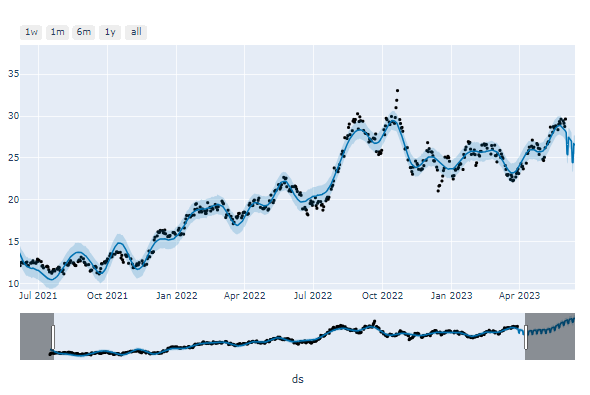

## 🤖 Projeto 

- Análise Preditiva para ações da Bolsa de Valores, desenvolvido em python no Jupyter Notebook.

- Aula 4 - Semana Python na Prática

  

 

 Gráfico interativo sendo executado no Jupyter Notebook 

 
 

